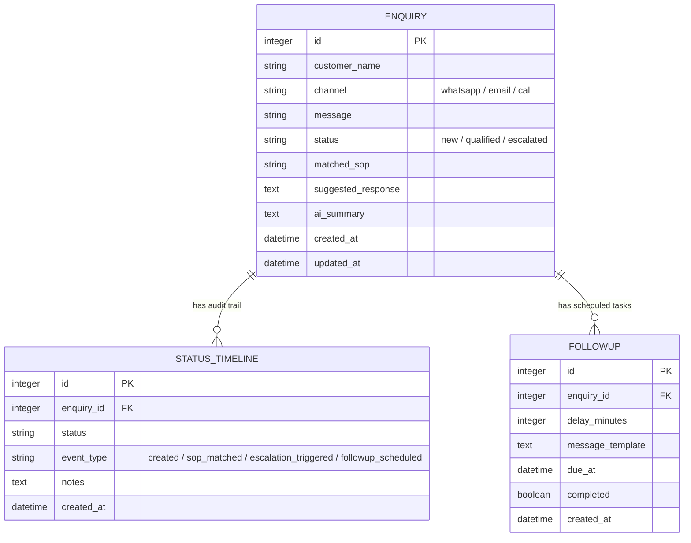

# Closira - AI-Powered SMB Customer Communication Platform

A premium full-stack prototype implementing **both** the **Backend Assignment** (FastAPI + PostgreSQL + Celery/Redis + Structured JSON Logging + Real Google Gemini AI API) and the **Frontend Assignment** (React Native Expo mobile dashboard + bottom tabs + conversation audit stack).

This repository is structured cleanly with a divided `/backend` and `/frontend` layout, presenting a production-ready architectural foundation for qualifying leads, scheduling follow-ups, and managing escalations.

---

## 📂 Project Architecture

```text
closira/
├── backend/                  # REST API & Asynchronous Task Pipeline
│   ├── app/
│   │   ├── api/              # HTTP Routing Controllers
│   │   │   └── v1/
│   │   │       ├── endpoints/
│   │   │       │   ├── auth.py          # Custom JWT user authentication (Mock)
│   │   │       │   ├── enquiry.py       # Enquiry create, followup, escalate, history APIs
│   │   │       │   └── health.py        # Database connectivity check endpoint
│   │   │       └── api.py               # Aggregated V1 API Router
│   │   ├── core/             # Central configs, DB sessions, Gemini AI integration
│   │   │   ├── ai.py                    # Google Gemini REST Client & Prompts
│   │   │   ├── celery_app.py
│   │   │   ├── config.py
│   │   │   └── database.py
│   │   ├── crud/             # Atomic database CRUD helpers
│   │   │   ├── base.py
│   │   │   └── enquiry.py
│   │   ├── models/           # SQLAlchemy Declarative DB Models
│   │   │   ├── enquiry.py               # Enquiry (with ai_summary), StatusTimeline, Followup
│   │   │   └── user.py
│   │   ├── schemas/          # Pydantic input validation & response models
│   │   │   └── enquiry.py
│   │   ├── workers/          # Celery worker process tasks
│   │   │   └── tasks.py                 # Dual-Mode AI & keyword fallback processor
│   │   └── main.py           # FastAPI application root & middleware setup
│   └── requirements.txt      # Python dependencies
├── frontend/                 # React Native Mobile Dashboard (Expo SDK 51)
│   ├── src/
│   │   ├── components/       # Reusable components
│   │   │   ├── ChannelBadge.tsx         # Whatsapp, Email, Call colors
│   │   │   ├── StatusBadge.tsx          # New, Qualified, Escalated colors
│   │   │   ├── StatCard.tsx             # Grid metrics widget
│   │   │   ├── LeadCard.tsx             # Feed list touchable card
│   │   │   ├── EscalationCard.tsx       # Active review log card
│   │   │   └── FollowupCard.tsx         # Task checklist item card
│   │   ├── mock/             # Strongly-typed rich API-ready JSON mocks
│   │   │   └── data.ts
│   │   ├── navigation/       # Tabs & Stack navigation registry
│   │   │   └── AppNavigator.tsx
│   │   ├── screens/          # Visual Dashboard views
│   │   │   ├── DashboardScreen.tsx
│   │   │   ├── LeadsScreen.tsx
│   │   │   ├── EscalationsScreen.tsx
│   │   │   ├── FollowupsScreen.tsx
│   │   │   └── ConversationDetailScreen.tsx
│   │   ├── services/         # Axios API client setup
│   │   │   └── api.ts
│   │   └── styles/           # Theme colors, sizes, and spacing scales
│   │       └── theme.ts
│   ├── App.tsx               # Root component (renders AppNavigator)
│   ├── package.json          # Node dependencies
│   └── tsconfig.json         # TypeScript configuration
├── docker-compose.yml        # PostgreSQL & Redis datastore provisioning
└── README.md                 # System documentation & setup guide
```

---

## 🛠️ Combined Setup & Run Instructions

Ensure you have **Docker Desktop** running, and **Node.js (LTS)** and **Python 3.10+** installed on your host machine.

### Step 1: Provision Datastores (Docker)
From the project root directory, spin up PostgreSQL and Redis:
```bash
docker compose up -d
```
*Verify containers `closira_postgres` (5432) and `closira_redis` (6379) are running.*

### Step 2: Set Up and Start the Backend
1. Open a terminal in the `/backend` directory:
   ```bash
   cd backend
   ```
2. Create and activate a Python virtual environment:
   ```bash
   python -m venv venv
   # On Windows:
   venv\Scripts\activate
   # On macOS/Linux:
   source venv/bin/activate
   ```
3. Install dependencies:
   ```bash
   pip install -r requirements.txt
   ```
4. **[Optional] Configure Google Gemini AI Integration**:
   - To activate live LLM intent analysis, SOP classification, and suggested response drafting, copy `.env.example` to `.env` (or create a `.env` file inside the `backend/` folder) and add your API key:
     ```text
     GEMINI_API_KEY=AIzaSy...your-actual-gemini-api-key...
     ```
   - *If no key is configured, the system gracefully operates in local fallback mode using robust regex keyword matching rules. No crash or error will occur.*

5. Initialize the PostgreSQL database tables:
   ```bash
   python -c "from app.core.database import Base, engine; import app.models; Base.metadata.create_all(bind=engine)"
   ```
6. Start the FastAPI Uvicorn web server:
   ```bash
   uvicorn app.main:app --reload
   ```
   *The Swagger interactive documentation is now available at [http://localhost:8000/docs](http://localhost:8000/docs).*

7. Open a **separate terminal window**, activate the virtual environment, and launch the Celery task worker:
   ```bash
   # On Windows (utilises the stable solo pool):
   celery -A app.core.celery_app worker --loglevel=info -P solo
   # On macOS/Linux:
   celery -A app.core.celery_app worker --loglevel=info
   ```

### Step 3: Start the Mobile Dashboard
1. Open a terminal in the `/frontend` directory:
   ```bash
   cd ../frontend
   ```
2. Install the aligned Node packages:
   ```bash
   npm install --legacy-peer-deps
   ```
3. Start the Metro developer bundler:
   ```bash
   npm run start
   ```
4. **Boot on your Phone**: Open the **Expo Go** app on your physical iOS/Android device, tap "Enter URL manually" and type:
   ```text
   exp://<your-computer-ip-address>:8081
   ```
   *(e.g., `exp://10.42.71.1:8081` as mapped by your local Wi-Fi adapter).*

---

## ⚙️ Backend Engineering Decisions & Rationale

### 1. Database Choice: PostgreSQL
We selected **PostgreSQL** over SQLite for this prototype to demonstrate a production-ready data layer:
* **Concurrence & Row-locking**: Managing concurrent write streams from multiple channels without locking database connections.
* **Complex Audits**: It easily handles complex JSON logging fields and maintains structured timeline logs with cascade-on-delete constraints cleanly.

#### Database Schema Model:


### 2. Live AI Integration (Google Gemini) & Local Fallback Resilience
Rather than relying solely on fragile regex parsing, we integrated a real-time **Google Gemini AI Client** inside our asynchronous queue:
* **LLM Engine (`gemini-2.5-flash`)**: Used for high-speed context summarization, robust SOP mapping, and contextual suggested replies.
* **Zero SDK Dependency**: Built utilizing native `httpx` JSON payload REST dispatches to maximize network performance.
* **Fail-Safe Keyword Matching**: If no API key is specified, or a connection error occurs, the pipeline automatically detects the state, logs a structured JSON entry, and executes a robust local keyword parsing algorithm.

### 3. Async Task Broker: Celery + Redis
* Decouples the API thread from heavy processing operations (AI requests can take up to 2-3 seconds).
* Allows `POST /enquiry` to return a `202 Accepted` status and unique `job_id` in **under 15 milliseconds**, guaranteeing an instant, high-concurrency client experience.

### 4. Structured JSON Logging
Rather than outputting plain text, we designed a custom `JsonFormatter` in `app/core/logging.py` that formats logs into a standardized, machine-readable JSON structure. This is ideal for production parsing (such as Datadog or ELK stack ingestion):
```json
{
  "timestamp": "2026-05-23T12:16:11.356805Z",
  "level": "INFO",
  "logger": "closira",
  "message": "Successfully processed enquiry using Google Gemini LLM API.",
  "extra": {
    "enquiry_id": 1,
    "matched_sop": "SOP-001: Lead Qualification & Booking",
    "status": "qualified",
    "ai_summary": "Wants to book a product demo session next Monday."
  }
}
```

---

## 🎨 Frontend Styling & Component Design

### 1. Styling Framework: React Native StyleSheet
We utilized standard React Native **StyleSheet** design tokens over NativeWind/Tailwind for maximum performance and explicit layout control:
* Centralized in `src/styles/theme.ts`, implementing a premium slate color system, spacing values, custom border radiuses, and readable sizing scales.
* **Badge Standards**:
  * **Channels**: WhatsApp (**Green** `#10B981`), Email (**Blue** `#3B82F6`), Call (**Amber** `#F59E0B`).
  * **Statuses**: New (**Sky Blue** `#38BDF8`), Qualified (**Green** `#10B981`), Escalated (**Red** `#EF4444`).

### 2. Screen Experiences & UX Features
* **Dashboard (Home)**: Real-time metric cards and recent activities, plus a **live simulation control panel** to test inbounds and see counts update.
* **Leads Feed**: Comprehensive categorized lists with dynamic status filters.
* **Escalations Alert Center**: Isolated HIGH/MEDIUM priority view with a prominent, single-tap **"Resolve"** button.
* **Conversation Audit Detail Stack**: Renders visual speech bubbles, copyable automated replies matching the SOP, a **1-sentence AI Summary Capsule** (pulled directly from the backend's new `ai_summary` column!), and a vertical status audit timeline.

---

## 🧪 API Verification CURL Commands

You can run these standard testing commands in your shell to verify API endpoints:

### 1. API Health & DB Connectivity Check
```bash
curl -X GET http://localhost:8000/api/v1/health
```

### 2. Submit an Enquiry (Unlocks Gemini AI / Keyword matching)
```bash
curl -X POST http://localhost:8000/api/v1/enquiry \
  -H "Content-Type: application/json" \
  -d "{\"customer_name\": \"Sarah Connor\", \"channel\": \"whatsapp\", \"message\": \"I want to book an appointment next Tuesday at 10 AM.\"}"
```

### 3. Retrieve Complete Enquiry Audit History & AI Summary
```bash
curl -X GET http://localhost:8000/api/v1/enquiry/1/history
```

---

## ⚖️ Trade-offs & Production Scaling Path

### 1. Plain Text Password Storing (Mock Auth)
* *Prototype Trade-off*: `/backend/app/crud/user.py` creates a user using a mock plain text password entry.
* *Production Path*: Leverage `passlib[bcrypt]` to secure and hash user password values prior to DB ingestion, verifying logins with standard OAuth2 bearer tokens.

### 2. Database Indexes & Alembic Migrations
* *Prototype Trade-off*: Tables are mapped directly using SQLAlchemy's declarative base.
* *Production Path*: Run robust database migrations using **Alembic** (`alembic upgrade head`) and configure appropriate database indexes on frequently queried fields (`channel`, `status`, `due_at`) to maximize query execution speeds.
