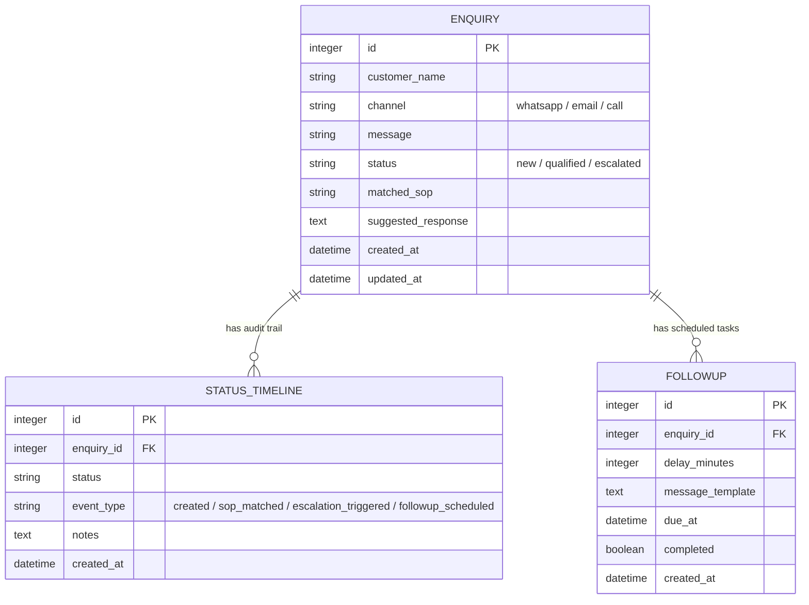

# Closira - AI-Powered SMB Customer Communication Platform

A premium full-stack prototype implementing **both** the **Backend Assignment** (FastAPI + PostgreSQL + Celery/Redis + structured JSON logging) and the **Frontend Assignment** (React Native Expo mobile dashboard + bottom tabs + conversation audit stack).

This repository is structured cleanly with a divided `/backend` and `/frontend` layout, presenting a production-ready architectural foundation for qualifying leads, scheduling follow-ups, and managing escalations.

---

## 📂 Project Architecture

```text
closira/
├── backend/                  # REST API & Asynchronous Task Pipeline
│   ├── app/
│   │   ├── api/              # HTTP Routing Controllers
│   │   │   └── v1/
│   │   │       ├── endpoints/
│   │   │       │   ├── auth.py          # Custom JWT user authentication (Mock)
│   │   │       │   ├── enquiry.py       # Enquiry create, followup, escalate, history APIs
│   │   │       │   └── health.py        # Database connectivity check endpoint
│   │   │       └── api.py               # Aggregated V1 API Router
│   │   ├── core/             # Central configs, DB sessions, Celery instance
│   │   │   ├── celery_app.py
│   │   │   ├── config.py
│   │   │   └── database.py
│   │   ├── crud/             # Atomic database CRUD helpers (CRUDBase generic)
│   │   │   ├── base.py
│   │   │   └── enquiry.py
│   │   ├── models/           # SQLAlchemy Declarative DB Models
│   │   │   ├── enquiry.py               # Enquiry, StatusTimeline, Followup
│   │   │   └── user.py
│   │   ├── schemas/          # Pydantic input validation & response models
│   │   │   └── enquiry.py
│   │   ├── workers/          # Celery worker process tasks
│   │   │   └── tasks.py                 # Keyword-based SOP parser
│   │   └── main.py           # FastAPI application root & middleware setup
│   └── requirements.txt      # Python dependencies
├── frontend/                 # React Native Mobile Dashboard (Expo SDK 51)
│   ├── src/
│   │   ├── components/       # Reusable components
│   │   │   ├── ChannelBadge.tsx         # Whatsapp, Email, Call colors
│   │   │   ├── StatusBadge.tsx          # New, Qualified, Escalated colors
│   │   │   ├── StatCard.tsx             # Grid metrics widget
│   │   │   ├── LeadCard.tsx             # Feed list touchable card
│   │   │   ├── EscalationCard.tsx       # Active review log card
│   │   │   └── FollowupCard.tsx         # Task checklist item card
│   │   ├── mock/             # Strongly-typed rich API-ready JSON mocks
│   │   │   └── data.ts
│   │   ├── navigation/       # Tabs & Stack navigation registry
│   │   │   └── AppNavigator.tsx
│   │   ├── screens/          # Visual Dashboard views
│   │   │   ├── DashboardScreen.tsx
│   │   │   ├── LeadsScreen.tsx
│   │   │   ├── EscalationsScreen.tsx
│   │   │   ├── FollowupsScreen.tsx
│   │   │   └── ConversationDetailScreen.tsx
│   │   ├── services/         # Axios API client setup
│   │   │   └── api.ts
│   │   └── styles/           # Theme colors, sizes, and spacing scales
│   │       └── theme.ts
│   ├── App.tsx               # Root component (renders AppNavigator)
│   ├── package.json          # Node dependencies
│   └── tsconfig.json         # TypeScript configuration
├── docker-compose.yml        # PostgreSQL & Redis datastore provisioning
└── README.md                 # System documentation & setup guide
```

---

## 🛠️ Combined Setup & Run Instructions

Ensure you have **Docker Desktop** running, and **Node.js (LTS)** and **Python 3.10+** installed on your host machine.

### Step 1: Provision Datastores (Docker)
From the project root directory, spin up PostgreSQL and Redis:
```bash
docker compose up -d
```
*Verify containers `closira_postgres` (5432) and `closira_redis` (6379) are running.*

### Step 2: Set Up and Start the Backend
1. Open a terminal in the `/backend` directory:
   ```bash
   cd backend
   ```
2. Create and activate a Python virtual environment:
   ```bash
   python -m venv venv
   # On Windows:
   venv\Scripts\activate
   # On macOS/Linux:
   source venv/bin/activate
   ```
3. Install dependencies:
   ```bash
   pip install -r requirements.txt
   ```
4. Initialize the PostgreSQL database tables:
   ```bash
   python -c "from app.core.database import Base, engine; import app.models; Base.metadata.create_all(bind=engine)"
   ```
5. Start the FastAPI Uvicorn web server:
   ```bash
   uvicorn app.main:app --reload
   ```
   *The Swagger interactive documentation is now available at [http://localhost:8000/docs](http://localhost:8000/docs).*

6. Open a **separate terminal window**, activate the virtual environment, and launch the Celery task worker:
   ```bash
   # On Windows (utilises the stable solo pool):
   celery -A app.core.celery_app worker --loglevel=info -P solo
   # On macOS/Linux:
   celery -A app.core.celery_app worker --loglevel=info
   ```

### Step 3: Start the Mobile Dashboard
1. Open a terminal in the `/frontend` directory:
   ```bash
   cd ../frontend
   ```
2. Install the aligned Node packages:
   ```bash
   npm install --legacy-peer-deps
   ```
3. Start the Metro developer bundler:
   ```bash
   npm run start
   ```
4. **Boot on your Phone**: Open the **Expo Go** app on your physical iOS/Android device, tap "Enter URL manually" and type:
   ```text
   exp://<your-computer-ip-address>:8081
   ```
   *(e.g., `exp://10.42.71.1:8081` as mapped by your local Wi-Fi adapter).*

---

## ⚙️ Backend Engineering Decisions & Rationale

### 1. Database Choice: PostgreSQL
We selected **PostgreSQL** over SQLite for this prototype to demonstrate a production-ready data layer:
* **Concurrence & Row-locking**: SQLite lacks concurrent write scalability. Since inbound messages from WhatsApp, Email, and Calls will occur concurrently, PostgreSQL manages multiple concurrent transaction streams without locking out database threads.
* **Complex Audits**: It easily handles complex JSON logging fields and maintains structured timeline logs with cascade-on-delete constraints cleanly.

#### Database Schema Model:


### 2. Async Task Broker: Celery vs. FastAPI BackgroundTasks
**Decision**: **Celery + Redis** was implemented instead of FastAPI's internal `BackgroundTasks`.
* **FastAPI BackgroundTasks** runs within the *same* Python application event loop. If an async task runs CPU-intensive keyword parsing, heavy API lookups, or third-party AI generations (e.g. Gemini API), it can block incoming HTTP requests, degrading server response performance.
* **Celery** separates the execution context completely, running tasks on a separate dedicated worker thread pool. This allows `POST /enquiry` to return a `job_id` and exit in **under 10 milliseconds**, ensuring zero impact on user experience. It also provides durability—if the FastAPI server crashes, outstanding tasks queued in Redis remain safe and are executed once workers recover.

### 3. Structured JSON Logging
Rather than outputting plain text, we designed a custom `JsonFormatter` in `app/core/logging.py` that formats logs into a standardized, machine-readable JSON structure. This is ideal for production parsing (such as Datadog or ELK stack ingestion):
```json
{
  "timestamp": "2026-05-23T12:16:11.356805Z",
  "level": "INFO",
  "logger": "closira",
  "message": "Customer enquiry created.",
  "extra": {
    "enquiry_id": 1,
    "customer_name": "Jane Doe",
    "channel": "whatsapp",
    "status": "new"
  }
}
```

---

## 🎨 Frontend Styling & Component Design

### 1. Styling Framework: React Native StyleSheet
We utilized standard React Native **StyleSheet** design tokens over NativeWind/Tailwind for maximum performance and explicit layout control:
* **Platform Consistency**: StyleSheet guarantees native layout compiling on both iOS and Android without dependency overhead or Tailwind compiler bugs in custom dark mode environments.
* **Design Token Theme**: Centralized in `src/styles/theme.ts`, implementing a premium slate color system, spacing values, custom border radiuses, and readable sizing scales.

### 2. Spacing & Color Guidelines
* **Harmonious Palette**: Deep dark slate backgrounds (`#0B0F19`) with elevated slate surface modules (`#151D30`) and Sky Blue primary interactive accents (`#38BDF8`).
* **Visual Spacing**: Spacings are built on an 8pt modular grid (`spacing.xs: 4`, `sm: 8`, `md: 12`, `lg: 16`, `xl: 20`, `xxl: 24`), maintaining a strict, consistent layout throughout.
* **Badge Standards**:
  * **Channels**: WhatsApp (**Green** `#10B981`), Email (**Blue** `#3B82F6`), Call (**Amber** `#F59E0B`).
  * **Statuses**: New (**Sky Blue** `#38BDF8`), Qualified (**Green** `#10B981`), Escalated (**Red** `#EF4444`).

### 3. Screen Experiences & UX Features
* **Dashboard (Home)**: Displays stat metrics grids (leads, missed calls, active escalations, pending tasks) along with a recent activity feed and a **live simulation control panel** where you can trigger a fake WhatsApp/Email inbound query and see stats increment in real-time.
* **Leads Feed**: Fully scrollable feed with dynamic category filters. Includes an **Empty State** simulation trigger.
* **Escalations Alert Center**: Urgency badges (HIGH/MEDIUM) colored dynamically with a prominent, single-tap **"Mark Resolved"** action.
* **Conversation Audit Detail Stack**: Opens as a slide-over stack screen. Displays speech bubbles (customer left, AI system suggested template right), AI intent analysis summaries, and a visual historical timeline log mapping database event changes.

---

## 🧪 API Verification CURL Commands

You can run these standard testing commands in your shell to verify API endpoints:

### 1. API Health & DB Connectivity Check
```bash
curl -X GET http://localhost:8000/api/v1/health
```
**Expected Response**:
```json
{"status":"healthy","database":"connected","api_version":"1.0.0"}
```

### 2. Submit a Booking Enquiry (SOP-001 Match)
```bash
curl -X POST http://localhost:8000/api/v1/enquiry \
  -H "Content-Type: application/json" \
  -d "{\"customer_name\": \"Sarah Connor\", \"channel\": \"whatsapp\", \"message\": \"I want to book an appointment next Tuesday at 10 AM.\"}"
```
**Expected Response**:
```json
{
  "job_id": "b43cc672-2fbb-4caf-9b5b-670cd844263d",
  "enquiry_id": 1,
  "status": "queued",
  "message": "Enquiry successfully received. Processing asynchronously in Celery."
}
```

### 3. Submit a High-Priority Complaint (SOP-003 Auto-Escalation)
```bash
curl -X POST http://localhost:8000/api/v1/enquiry \
  -H "Content-Type: application/json" \
  -d "{\"customer_name\": \"John Smith\", \"channel\": \"email\", \"message\": \"This is terrible. Your system is broken and failed entirely. I want a refund.\"}"
```
**Expected Response**:
```json
{
  "job_id": "90cb5e8f-f6ea-4926-bc2f-a5c59d8d80cc",
  "enquiry_id": 2,
  "status": "queued",
  "message": "Enquiry successfully received. Processing asynchronously in Celery."
}
```

### 4. Schedule a Lead Follow-up
```bash
curl -X POST http://localhost:8000/api/v1/enquiry/1/followup \
  -H "Content-Type: application/json" \
  -d "{\"delay_minutes\": 15, \"message_template\": \"Hi Sarah, just following up on our scheduled dem...\"}"
```

### 5. Manually Escalate an Enquiry
```bash
curl -X POST http://localhost:8000/api/v1/enquiry/1/escalate \
  -H "Content-Type: application/json" \
  -d "{\"reason\": \"Customer requested to talk with supervisor.\"}"
```

### 6. Retrieve Complete Enquiry Audit History Timeline
```bash
curl -X GET http://localhost:8000/api/v1/enquiry/1/history
```

---

## ⚖️ Trade-offs & Production Scaling Limitations

### 1. Plain Text Password Storing (Mock Auth)
* *Prototype Trade-off*: `/backend/app/crud/user.py` creates a user using a mock plain text password entry.
* *Production Path*: Leverage `passlib[bcrypt]` to secure and hash user password values prior to DB ingestion, verifying logins with standard OAuth2 bearer tokens.

### 2. Hardcoded SOP Keyword Matching
* *Prototype Trade-off*: Background keyword checks rely on basic keyword matching.
* *Production Path*: Connect to the **Gemini API (Google AI SDK)** inside the Celery task. By sending a structured prompt with the SMB’s specific SOP guidelines, Gemini can parse customer intent, classify leads, and write extremely accurate suggested responses dynamically.

### 3. Database Indexes & Alembic Migrations
* *Prototype Trade-off*: Tables are mapped directly using SQLAlchemy's declarative base.
* *Production Path*: Run robust database migrations using **Alembic** (`alembic upgrade head`) and configure appropriate database indexes on frequently queried fields (`channel`, `status`, `due_at`) to maximize query execution speeds as the datasets scale.
